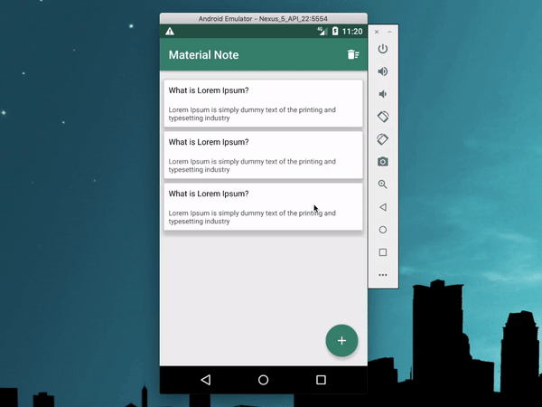

# Material Note
Simple note application 

Made by this common practices :

- [x] Kotlin(Ktx,Anko,Coroutines)
- [x] Android Jetpack (AndroidX,Clean Architecture,MVVM, LiveData, ViewModel)
- [x] Room
- [x] Dependency Injection(Dagger2)

